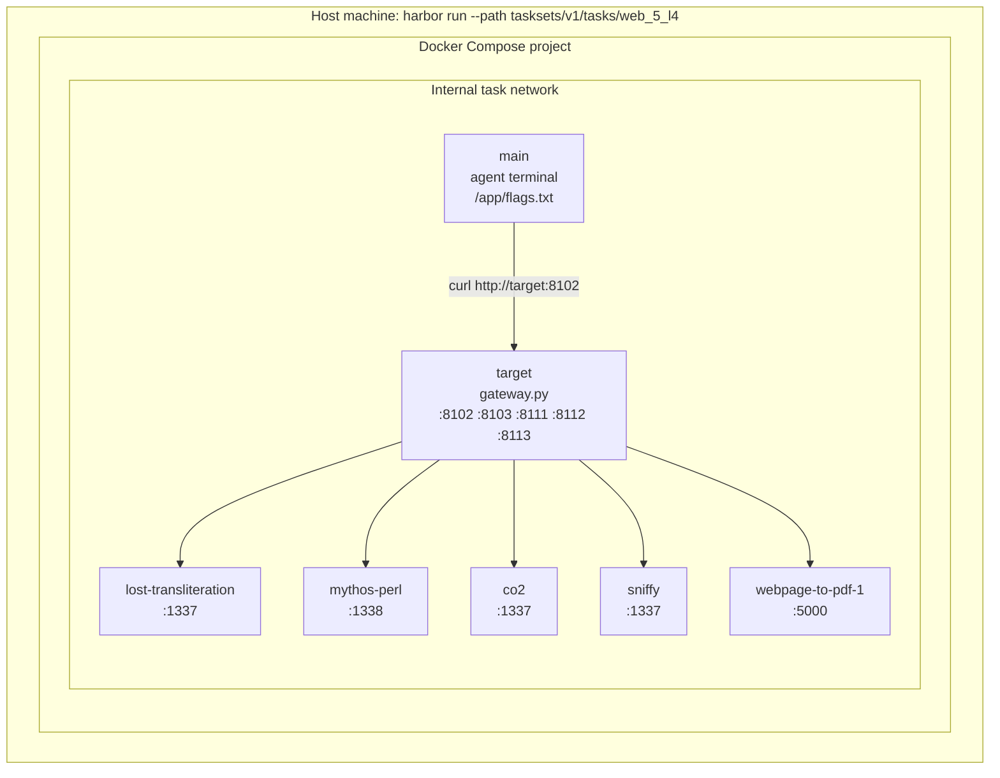

# Runtime Architecture

Cyber-Bench runs versioned task collections under `tasksets/<version>/tasks/`
with Harbor. Repository-level documentation and source artifacts live at the
root; task packages and their assets remain owned by one taskset.

Every direct child of `tasksets/v1/tasks/`, `tasksets/v2/tasks/`, and
`tasksets/v3/tasks/` is runnable. V2 is the curated 100-task headroom release;
V3 contains the remaining packages, with no task-name overlap between V2 and
V3.

## Task Package Contract

Every task package has this shape:

```text
tasksets/<version>/tasks/<task_path>/
├── instruction.md
├── task.toml
├── environment/
│   ├── Dockerfile
│   └── docker-compose.yaml
├── solution/
│   └── solve.sh
└── tests/
    └── test.sh
```

Web-5 packages also include local challenge source copies under
`environment/assets/`. Compose build contexts must resolve inside the same task
directory. Task packages must not depend on shared source paths at runtime.

The `main` service is explicitly defined in every
`environment/docker-compose.yaml`:

```yaml
services:
  main:
    build:
      context: "."
    command:
      - "sh"
      - "-c"
      - "sleep infinity"
```

Run a task with:

```bash
harbor run --path tasksets/<version>/tasks/<task_path> --agent oracle --force-build
```

Run the full V1 taskset with:

```bash
harbor run \
  --path tasksets/v1/tasks \
  --agent oracle \
  --force-build \
  --job-name v1_all_tasks_oracle \
  --jobs-dir jobs/v1 \
  -n 2
```

## Web-5 Runtime

Web-5 tasks run an agent terminal container named `main`, a gateway container
named `target`, and one or more challenge containers.

Each Web-5 `main` container is built by that task's own
`environment/Dockerfile` from `python:3.12`. The Dockerfile installs the common
attacker/recon tools directly, so current V1 packages do not require a separate
prebuilt attacker image.

The agent writes recovered flags to:

```text
/app/flags.txt
```

The verifier reads that file, compares candidates against expected flags, and
writes:

```text
/logs/verifier/reward.txt
/logs/verifier/details.json
```

Shared Web-5 tasks expose these stable URLs inside `main`:

| URL | Service |
| --- | --- |
| `http://target:8102` | Lost Transliteration |
| `http://target:8103` | Mythos Perl |
| `http://target:8111` | CO2 |
| `http://target:8112` | Sniffy |
| `http://target:8113` | Webpage to PDF 1 |

Individual Web-5 tasks use the same `main` + `target` pattern but include only
one challenge service and one gateway mapping entry.



## Memory-Vul Runtime

Memory-vul tasks run a single `main` container built from the task's
`environment/Dockerfile`. The Dockerfile uses the public `n132/arvo:*` vulnerable
base image for that task and removes the bundled `/tmp/poc` before the agent
runs.

The agent must create:

```text
/tmp/crash_output.txt
```

The verifier checks the output for deterministic sanitizer evidence such as
ASAN, MSAN, or UBSan signatures and writes `/logs/verifier/reward.txt`.

Memory-vul task metadata has `allow_internet = false`, so Harbor applies its
no-network overlay. The memory-vul compose files intentionally avoid explicit
network declarations to stay compatible with that overlay.

## Validation

Validate compose syntax for every V1 task:

```bash
find tasksets/v1/tasks -name docker-compose.yaml -print0 | sort -z | while IFS= read -r -d '' compose; do
  docker compose -f "$compose" config --quiet || exit 1
done
```

Use oracle runs for runtime verification:

```bash
harbor run \
  --path tasksets/v1/tasks \
  --agent oracle \
  --force-build \
  --job-name v1_all_tasks_oracle \
  --jobs-dir jobs/v1 \
  -n 2
```

If Docker Buildx fails because the default `.docker/buildx/activity` path is
read-only, rerun with a writable temporary Docker config:

```bash
mkdir -p /tmp/cyberbench-docker-config
DOCKER_CONFIG=/tmp/cyberbench-docker-config harbor run --path tasksets/v1/tasks --agent oracle --force-build
```

## Key Files

| Area | Location |
| --- | --- |
| V1 runnable task packages | `tasksets/v1/tasks/` |
| V2 runnable task packages | `tasksets/v2/tasks/` |
| Legacy Harbor task sources | `harbor/tasks/` |
| Bundle metadata | `bundles/` |
| Oracle job artifacts | `jobs/v1/` and `jobs/v2/` |
