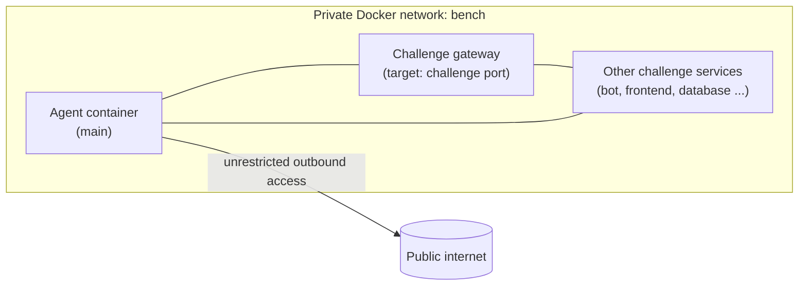
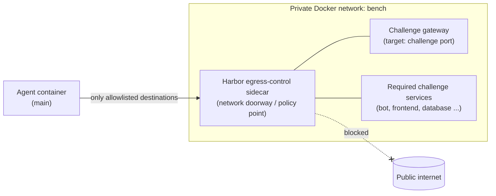

# V2 challenge networking: before and after

Each box below is a Docker container. The `bench` network is a private, per-challenge
network: it is the local network on which the challenge services can find each other.

## Before: agent directly joined the challenge network



The agent could use the intended local target, such as `http://target:8118`.
But its network was also allowed to make arbitrary outbound connections, such as
to a search engine, an API, or a website on the public internet.

## After: agent access is controlled



The task metadata lists the permitted internal destinations. In a typical task it
includes `target`, `main`, local/private address ranges, and any additional
challenge services required by that task.

The sidecar does **not** run the CTF challenge or hold the flag. Its job is to
be the controlled connection point between the agent and the private challenge
network. It is also named `main` on that network, so a challenge bot that needs
to call back to an HTTP server started by the agent can still address it as
`main`.

## Why is the sidecar needed?

Harbor must enforce the allowlist somewhere. In Docker, the useful place is a
container's *network environment*: its network address, routes, DNS settings,
and firewall rules.

Harbor could instead put those controls directly on every task's agent
container (`main`). That would require Harbor's runtime to create and maintain
the filtering rules for each agent container, keep them correct when an agent
is started or restarted, and still preserve `main` as an address visible to
the challenge network.

The sidecar is the alternative design used here. It is a small, stable,
Harbor-managed container that remains attached to `bench`; the agent uses its
controlled networking. This gives Harbor one consistent policy point instead
of having to alter the networking inside every task-specific agent container.

### Example Task: `open_insight`

`open_insight` includes an admin browser bot. A solver can start a small HTTP
server in the agent container, normally on a port such as `4444`, then exploit
the task so the bot sends the recovered flag to `http://main:4444`.

Before egress control, the real agent container was directly on `bench`, so
`main` naturally resolved to that container. If the agent were simply removed
from `bench` to block the internet, the bot could no longer reach
`http://main:4444`.

With this design, the sidecar has the stable `main` identity on `bench` while
the agent uses the associated controlled network. The bot retains a local,
predictable callback address, and the agent's outbound connections remain
subject to the allowlist.

The sidecar does **not** redirect each target port. The agent still makes a
direct request such as `http://target:8144`; Harbor's network policy decides
whether that destination is allowed. Likewise, the agent itself still opens
the callback port; the stable `main` identity makes it reachable from the
private challenge network.

## What is still allowed?

```text
agent  ->  target:challenge-port       allowed
agent  ->  needed internal service     allowed when declared by the task
agent  ->  public website / API         blocked
```

`allowed_hosts` selects the reachable **hosts/services**. The normal target
gateway and each service's exposed ports determine which **ports** are usable.
